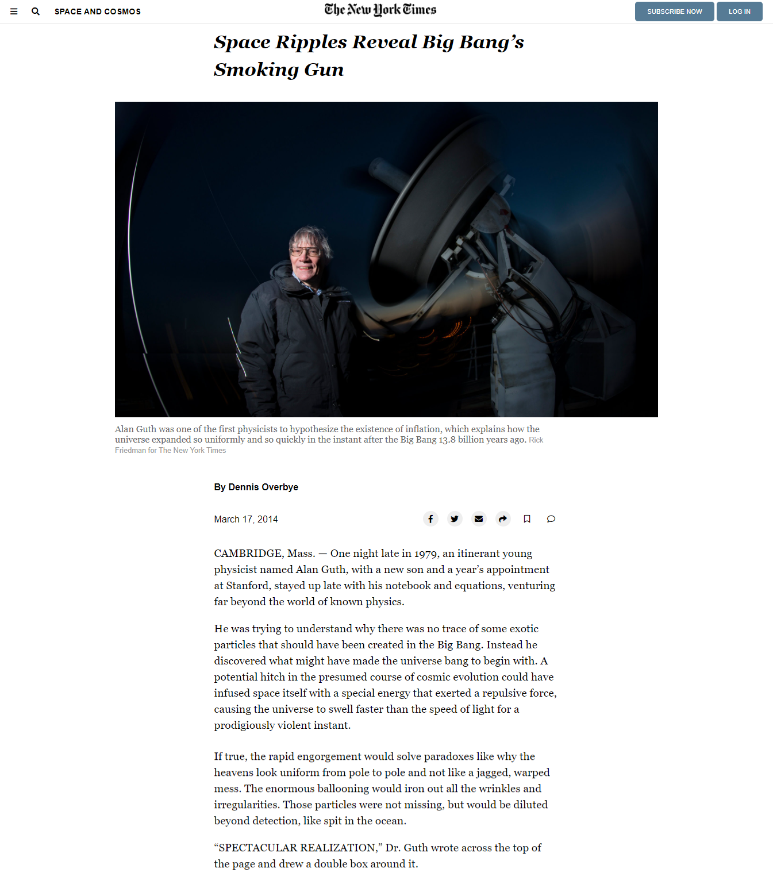

# New York Times Article Page Clone

> A clone of the New York Times article page ["Space Ripples Reveal Big Bang’s Smoking Gun"](https://www.nytimes.com/2014/03/18/science/space/detection-of-waves-in-space-buttresses-landmark-theory-of-big-bang.html). 

## Built With

- HTML
- CSS

## Live Demo

[Live Demo](https://brenoxav.github.io/nyt-clone-microverse/)

## Authors

👤 **Arturo Alvarez**

- GitHub: [@StarSheriff2](https://github.com/StarSheriff2)
- Twitter: [@Turo_83](https://twitter.com/Turo_83)
- LinkedIn: [Carlos Alvarez](https://www.linkedin.com/in/carlosalvarezveroy/)

👤 **Breno Xavier**

- GitHub: [@brenoxav](https://github.com/brenoxav)
- LinkedIn: [Breno Xavier](https://linkedin.com/in/brenoxav)

## 🤝 Contributing

Contributions, issues, and feature requests are welcome!

Feel free to check the [issues page](https://github.com/brenoxav/nyt-clone-microverse/issues).

## Show your support

Give a ⭐️ if you like this project!

## Acknowledgments

- Hat tip to anyone whose code was used
- Inspiration
- etc

## 📝 License

This project is [MIT](lic.url) licensed.